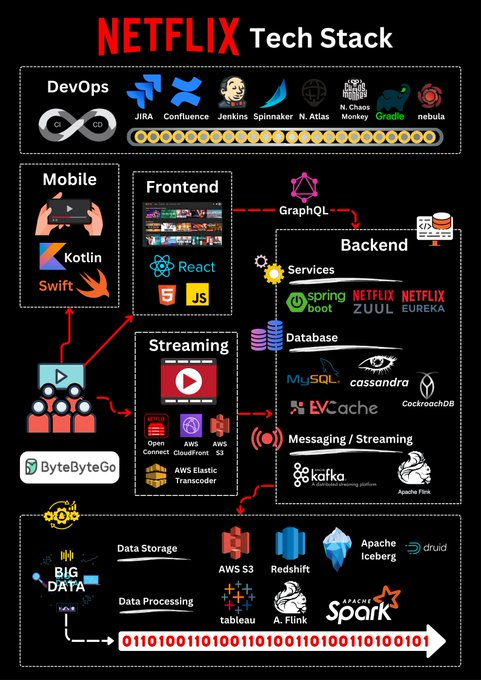
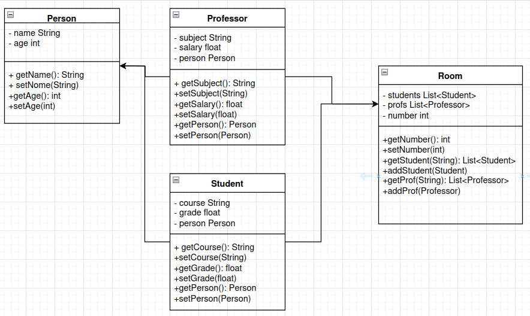

# Software Engineering

"We see three critical differences between programming and software engineering: time, scale, and the trade-offs at play. On a software engineering project, engineers need to be more concerned with the passage of time and the eventual need for change. In a software engineering organization, we need to be more concerned about scale and efficiency, both for the software we produce as well as for the organization that is producing it. Finally, as software engineers, we are asked to make more complex decisions with higher-stakes outcomes, often based on imprecise estimates of time and growth.

Within Google, we sometimes say, 'Software engineering is programming integrated over time.' Programming is certainly a significant part of software engineering: after all, programming is how you generate new software in the first place. If you accept this distinction, it also becomes clear that we might need to delineate between programming tasks (development) and software engineering tasks (development, modification, maintenance). The addition of time adds an important new dimension to programming. Cubes aren't squares, distance isn't velocity. Software engineering isn't programming."

Developing a piece of software isn't just about programming. Without the time and ability to discern between what you want and what you need for a project to work effectively and efficiently, one is simply typing words on a keyboard. Deciding what tools will better accommodate your requirements is, if not the most, important step in not only the software environment, but for all sorts of engineering landscapes.

## Trade-offs and Non-functional Requirements of Windows and Linux Ubuntu Operating Systems

1. **Performance**

   - **Ubuntu**: Generally known for having more efficient performance on older hardware and in environments with limited resources. Its architecture allows for effective management of memory and processes.
   - **Windows**: Although it has greatly evolved in terms of performance, especially in the most recent versions, it can be more demanding in terms of resources, especially with its graphical interfaces and advanced functionalities.

2. **Scalability**

   - **Ubuntu**: Highly scalable, it can be used on low-power devices up to large-scale servers. The use of different Linux distributions allows for optimized configuration for various types of hardware.
   - **Windows**: Also scalable, but the chosen version (such as Windows Server) must be appropriate for the purpose, and its scalability can be limited by specific hardware requirements.

3. **Security**

   - **Ubuntu**: Considered more secure by many users due to its permissions model and open-source nature, allowing constant auditing. Security updates are frequently released, and rapid adoption of patches is common.
   - **Windows**: Historically, it has faced more security issues, often being targeted by malware and viruses. However, Microsoft has improved security in recent versions, implementing tools like Windows Defender and regular updates.

4. **Maintainability**

   - **Ubuntu**: Maintenance can be easily done through the terminal and package managers. The active community contributes with documentation and support.
   - **Windows**: Although it offers graphical interfaces for most maintenance tasks, troubleshooting can be more complex in some cases, depending on the version and system configuration.

5. **Compatibility**

   - **Ubuntu**: Although it has a vast range of available software, compatibility with proprietary software, especially games and design tools, can be a limitation. However, there are many open-source alternatives.
   - **Windows**: Has wide compatibility with commercial software, including games and enterprise applications. Most developers prioritize Windows when creating new programs.

6. **Usability**

   - **Ubuntu**: The interface can be intuitive for users familiar with Linux systems, but it can pose a challenge for newcomers. However, distributions like Ubuntu Desktop strive to improve the user experience.
   - **Windows**: Generally considered more user-friendly and accessible for inexperienced users, with a familiar interface and extensive support in terms of tutorials and help.

7. **Support and Community**

   - **Ubuntu**: Has a very active community and a vast amount of online resources. Support is often offered through community forums and documentation.
   - **Windows**: Offers official technical support from Microsoft, as well as an extensive user base that can help with problems. The official documentation is very comprehensive.

8. **Cost**
   - **Ubuntu**: It is free and open-source, allowing users to download and install it at no cost. This also extends to many of the available applications.
   - **Windows**: Usually requires a paid license for installation, although there are free versions with limitations (such as Windows 10/11 in evaluation mode).

## Analysis of Netflix's Architecture



1. **DevOps**

   - **Tools**:
     - **JIRA, Confluence**: For project management and team collaboration.
     - **Jenkins, Spinnaker**: CI/CD tools for continuous integration and delivery.
     - **Nebula, Gradle**: Build automation and dependency management.
     - **N. Atlas, N. Chaos Monkey**: Netflix's own tools for infrastructure management and resilience testing.
   - **Why Chosen**: These tools streamline development and operations, ensuring efficient deployment, monitoring, and maintenance of services, with a strong focus on automation and reliability.

2. **Mobile Development**

   - **Languages/Frameworks**:
     - **Kotlin, Swift**: Used for Android and iOS mobile application development respectively.
   - **Why Chosen**: Kotlin and Swift are modern languages that offer strong support for native mobile development, providing a balance of performance, safety, and modern language features.

3. **Frontend Development**

   - **Technologies**:
     - **React**: A popular JavaScript library for building user interfaces.
     - **HTML5, JavaScript (JS)**: Core web technologies for building responsive and interactive web applications.
   - **Why Chosen**: React is known for its component-based architecture and efficient rendering, making it suitable for building scalable and high-performing user interfaces. HTML5 and JavaScript are the foundation of web development, providing a standardized way to create rich and interactive content.

4. **Backend Development**

   - **Services**:
     - **Spring Boot, Netflix OSS (Zuul, Eureka)**: Spring Boot is a popular framework for building microservices, while Netflix OSS provides a suite of tools for microservices architecture, including service discovery (Eureka) and routing (Zuul).
   - **Database**:
     - **MySQL, Cassandra, EVCache, CockroachDB**: These databases and caching solutions offer a mix of traditional relational database management (MySQL), distributed NoSQL storage (Cassandra, CockroachDB), and caching (EVCache).
   - **Why Chosen**: The backend stack supports microservices architecture, allowing Netflix to scale individual components independently. The use of different databases addresses various data storage needs, from transactional data to high-availability and distributed storage.

5. **Streaming**

   - **Tools**:
     - **AWS Open Connect, AWS CloudFront, S3, Elastic Transcoder**: These AWS services are critical for content delivery and video streaming.
   - **Why Chosen**: AWS provides scalable and reliable infrastructure for delivering high-quality video content globally. The integration with content delivery networks (CDNs) like CloudFront ensures low-latency streaming.

6. **Messaging/Streaming**

   - **Technologies**:
     - **Kafka, Apache Flink**: Kafka is used for real-time data streaming and messaging, while Apache Flink is used for real-time data processing.
   - **Why Chosen**: These tools enable Netflix to handle high-throughput data streams and process events in real-time, which is essential for features like real-time recommendations and analytics.

7. **Data Storage and Processing**

   - **Data Storage**:
     - **AWS S3, Redshift, Apache Iceberg, Druid**: These tools cover various data storage needs, from raw data storage (S3) to data warehousing (Redshift) and analytical data stores (Druid).
   - **Data Processing**:
     - **Apache Spark, Apache Flink**: Both are distributed data processing frameworks used for big data analytics.
   - **Why Chosen**: The data storage and processing stack is designed to handle large-scale data efficiently, enabling Netflix to analyze vast amounts of user data to optimize content delivery, recommendations, and business decisions.

8. **Visualization**
   - **Tools**:
     - **Tableau**: A popular tool for data visualization and business intelligence.
   - **Why Chosen**: Tableau enables Netflix to create interactive dashboards and visualizations, making it easier to gain insights from their data.

## Trade-offs in Database Choices for Netflix

- **MySQL, Cassandra, EVCache, CockroachDB vs. Alternatives (e.g., PostgreSQL, MongoDB, Redis)**:
  - **Trade-offs**:
    - **MySQL** is a solid relational database with a wide user base, but PostgreSQL offers more advanced features and better compliance with SQL standards.
    - **Cassandra** is highly scalable and suited for distributed data but can be complex to manage. MongoDB might offer easier scalability and flexibility for unstructured data, but with potential consistency trade-offs.
    - **EVCache** and CockroachDB provide distributed caching and transactional capabilities, respectively, but they come with increased operational complexity. Redis could be an alternative for caching, offering simplicity but not the same distribution capabilities as EVCache.

## UML Exercise



```java
class Person{
    private String name;
    private int age;

    public String getName(){
        return name;
    }
    public int getAge(){
        return age;
    }
    public void setName(String value){
        name = value;
    }
    public void setAge(int value){
        age = value;
    }
}
class Student{
    private String course;
    private float grade;
    private Person person;

    public String getCourse(){
        return course;
    }
    public float getGrade(){
        return grade;
    }
    public Person getPerson(){
        return person;
    }
    public void setCourse(String value){
        course = value;
    }
    public void setGrade(float value){
        grade = value;
    }
    public void setPerson(Person value){
        person = value;
    }
}
class Professor{
    private String subject;
    private float salary;
    private Person person;

    public String getSubject(){
        return subject;
    }
    public float getSalary(){
        return salary;
    }
    public Person getPerson(){
        return person;
    }
    public void setSubject(String value){
        subject = value;
    }
    public void setSalary(float value){
        salary = value;
    }
    public void setPerson(Person value){
        person = value;
    }
}
class Room{
    private List<Student> students = new LinkedList<Student>();
    private List<Professor> professors = new LinkedList<Professor>();
    private int number;

    public List<Student> getStudentByName(String name){
        List<Student> found = new LinkedList<Student>();
        for (Student student: students){
            if (student.getPerson().getName().equals(name)){
                found.add(student);
            }
        }
        return found;
    }
    public List<Professor> getProfessorByName(String name){
        List<Professor> found = new LinkedList<Professor>();
        for(Professor professor: professors){
            if (professor.getPerson().getName().equals(name)){
                found.add(professor);
            }
        }
        return found;
    }
    public int getNumber(){
        return number;
    }
    public void setStudent(Student student){
        students.add(student);
    }
    public void setProfessor(Professor professor){
        professors.add(professor);
    }
    public void setNumber(int value){
        number = value;
    }
}
```
